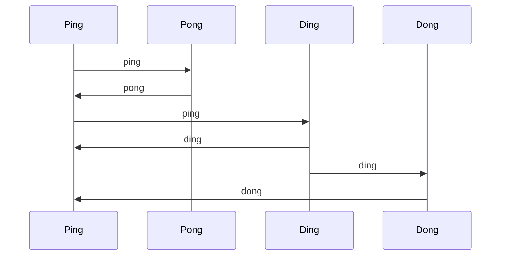

# Ping Pong, Ding Dong

This is a foolish little program meant to help learn Kubernetes. The basic
idea is that you deploy 4 services into a Kubernetes cluster:

- `ping`
- `pong`
- `ding`
- `dong`

Each service is actually just this program acting according to the environment
variable `PPDD_MODE` - which should be set to one of the values above.

Each service calls another service with a message. The message includes the
calling service's name and miscellaneous information to facilitate debugging
and learning.



The basic idea is that `ping` periodically calls out to `pong` and `ding`.
The `dong` service is opaque to `ping` - it is activated by `ding`.

Again, I said this is kind of stupid. It's meant to be just complicated enough 
to try some things out like upgrading individual services. I intend to extend
it to play around with service mesh, gRPC, observability tools, etc.

# Environment Variables

The program accepts parameters via various environment variables.

- `PPDD_MODE`: required, sets the type of service
- `HTTP_PORT`: optional, will default to `8080` but useful to set if testing 
  in a non-Kubernetes environment

# REST Interface

The program exports the following endpoints.

- `GET /`: display the mode and various information about the service
- `PUT /`: send a [JSON encoded message to the service](#message-format) 
- `GET /health`: JSON encoded health check
- `POST /shutdown`: cleanly shutdown the service

# Message Format

The endpoint `PUT /` accepts JSON encoded messages in the following format:

```json
{
  "Msg": "<string>"
}
```

Where `<string>` is one of; `ping`, `pong`, `ding`, or `dong`.

# Testing

To run the tests locally and check coverage.

```shell
go test -v -cover -coverprofile=c.out .
go tool cover -html=c.out

```
