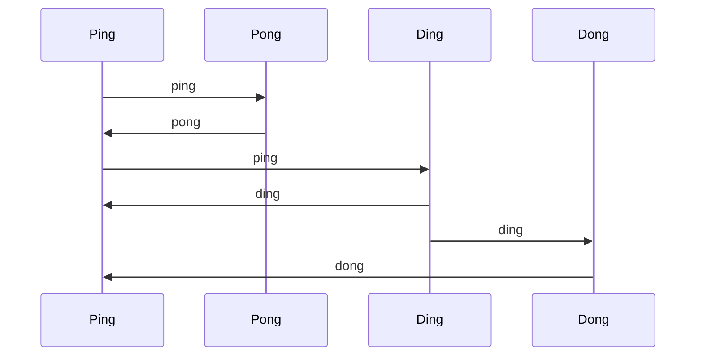

# Ping Pong, Ding Dong

This is a foolish little program meant to help learn Kubernetes. The basic
idea is that you deploy 4 services into a Kubernetes cluster:

- `ping`
- `pong`
- `ding`
- `dong`

Each service is actually just this program acting according to the environment
variable `PPDD_MODE` - which should be set to one of the values above.

Each service calls another service with a message. The message includes the
calling service's name and miscellaneous information to facilitate debugging
and learning.



The basic idea is that `ping` periodically calls out to `pong` and `ding`.
The `dong` service is opaque to `ping` - it is activated by `ding`.

Again, I said this is kind of stupid. It's meant to be just complicated enough 
to try some things out like upgrading individual services. I intend to extend
it to play around with service mesh, gRPC, observability tools, etc.

# Environment Variables

The program accepts parameters via various environment variables.

- `PPDD_MODE`: required, sets the type of service
- `HTTP_PORT`: (_optional_ `8080`) but useful to set if testing in a
   non-Kubernetes environment
- `NAMESPACE`: (_optional_ `default`) Kubernetes namespace (set to `localhost`
   if testing locally)
- `PING_SVC`: (_optional_ `ping`)
- `PING_PORT`: (_optional_ `8080`)
- `PONG_SVC`: (_optional_ `pong`)
- `PONG_PORT`: (_optional_ `8080`)

Inside a cluster, the services will find each other via:

```text
 {PING_SVC}.{NAMESPACE}.svc.cluster.local
```

If `NAMESPACE == localhost` then we assume you are just running the binaries
locally in different processes so the services will find each other via:

```text
  localhost:{PING_PORT}
```

# REST Interface

The program exports the following endpoints.

- `GET /`: display the mode and various information about the service
- `POST /`: send a [JSON encoded message to the service](#message-format) 
- `GET /health`: JSON encoded health check
- `POST /shutdown`: cleanly shutdown the service

# Message Format

The endpoint `PUT /` accepts JSON encoded messages in the following format:

```json
{
  "Msg": "<string>"
}
```

Where `<string>` is one of; `ping`, `pong`, `ding`, or `dong`.

# Testing

## Manual Tests

### Single Mode
```shell
# Start the program in a mode of your choice
PPDD_MODE=dong HTTP_PORT=8989 go run .

# In another terminal, run commands
curl localhost:8989/health
# {"Status":"OK"}
curl localhost:8989/
# Hello from: 127.0.0.1:8989:
#   mode: dong
#   operating system: darwin
# ...
curl -v -X POST localhost:8989/ \
  -H 'Content-Type: application/json' \
  -d '{"Msg": "ding"}'

curl -X POST localhost:8989/shutdown
# Shutting down
```

### Ping and Pong

```shell
# Terminal 1
PPDD_MODE=dong \
  HTTP_PORT=8083 \
  NAMESPACE=localhost \
  PING_PORT=8080 \
  PONG_PORT=8081 \
  DING_PORT=8082 \
  DONG_PORT=8083 \
  go run .

# Terminal 2
PPDD_MODE=ding \
  HTTP_PORT=8082 \
  NAMESPACE=localhost \
  PING_PORT=8080 \
  PONG_PORT=8081 \
  DING_PORT=8082 \
  DONG_PORT=8083 \
  go run .

# Terminal 3
PPDD_MODE=pong \
  HTTP_PORT=8081 \
  NAMESPACE=localhost \
  PING_PORT=8080 \
  PONG_PORT=8081 \
  DING_PORT=8082 \
  DONG_PORT=8083 \
  go run .

# Terminal 4
PPDD_MODE=ping \
  HTTP_PORT=8080 \
  NAMESPACE=localhost \
  PING_PORT=8080 \
  PONG_PORT=8081 \
  DING_PORT=8082 \
  DONG_PORT=8083 \
  go run .
```

## Unit Tests
To run the tests locally and check coverage.

```shell
go test -v -cover -coverprofile=c.out .
go tool cover -html=c.out

```


# Kubernetes

There is a [sample YAML file](./k8s/ppdd.yml) that uses the following K8s
features:

- ConfigMap
- Secret
- Service
- Deployment

The secret is used to access GitHub's private container registry. You should
follow the instructions on GitHub to create a Personal Access Token (PAT) with
read access to the registry. Then create the K8s secret as below:

```shell
kubectl create secret docker-registry ghcr.io \
  --docker-server=https://ghcr.io/v1/ \
  --docker-username=michaelerickson \
  --docker-email=erickson.michael@gmail.com \
  --docker-password=ghp_Wxxx
```

This will be references in a Pod as:

Use the secret in a Pod:

```yaml
apiVersion: v1
kind: Pod
metadata:
  name: private-reg
spec:
  containers:
    - name: private-reg-container
      image: private-image:latest
  imagePullSecrets:
    - name: ghcr.io   # <--- match name of secret you created above ---
```

Set the cluster up via:

```shell
kubectl apply -f ppdd.yml

# Delete things later via:
kubectl delete -f ppdd.yml

# Debug the network by running a container with various networking diagnostic
# tools on it
kubectl run -it dnsutils --image gcr.io/kubernetes-e2e-test-images/dnsutils:1.3
nslookup pong
# Server:		10.43.0.10
# Address:	10.43.0.10#53
# 
# Name:	pong.default.svc.cluster.local
# Address: 10.43.147.93

wget http://pong.default.svc.cluster.local:8080/
# Connecting to pong.default.svc.cluster.local:8080 (10.43.147.93:8080)
# index.html           100% |**************************|  1165   0:00:00 ETA

cat index.html
# Hello from: 10.42.0.98:8080:
#   mode: pong
#   operating system: linux
# ...

# Remove the debug pod
exit  # return to local terminal (ctl-d also works)
kubectl delete pods/dnsutils
```
